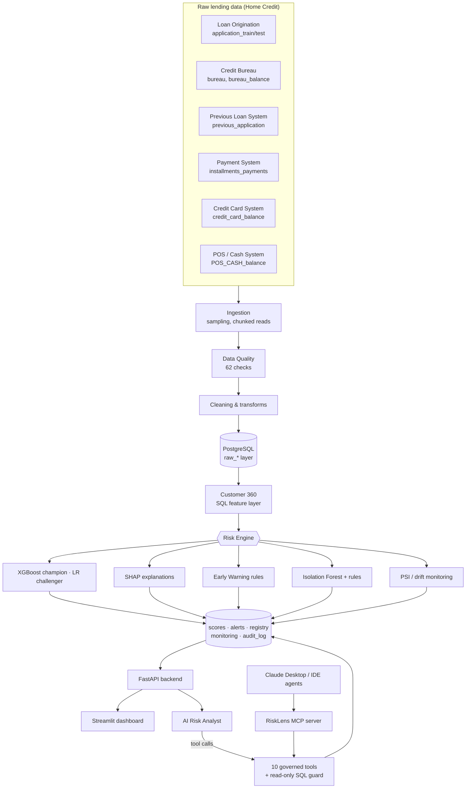
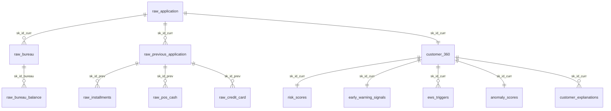
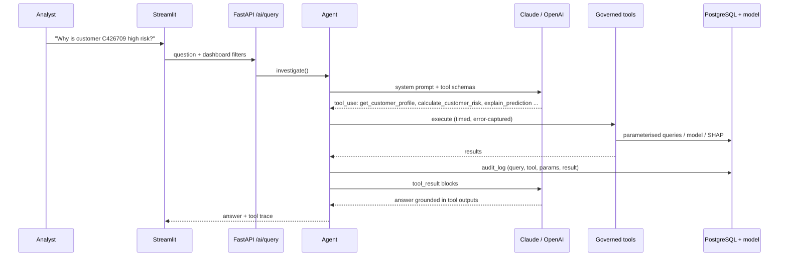

# RiskLens — AI-Powered Lending Risk Intelligence Platform

[](https://risklens-app.streamlit.app/)

**Live demo:** https://risklens-app.streamlit.app/ (free hosting; the first load after a quiet period can take about a minute while the app and database wake up). The demo runs on a 30,000-customer sample, so its numbers differ slightly from the full local build described below.

> **RiskLens is an AI-powered lending risk intelligence platform that helps risk teams monitor portfolio health, identify emerging credit risk, investigate suspicious behaviour, explain model decisions and use an AI Risk Analyst to perform data-driven investigations.**

RiskLens is a working internal risk platform for a fictional digital lender. It combines data engineering, a PostgreSQL data model, a Customer 360, portfolio analytics, credit-risk models with SHAP explanations, an Early Warning System, behavioural anomaly detection, model monitoring and a tool-using AI analyst (also exposed over MCP), wired together behind a FastAPI backend and a Streamlit dashboard.

Every number on screen is computed from the database or the model at request time: filters change the KPIs, charts and tables, a selected customer loads their actual data, and the AI answers only from tool calls on live data.

| | |
|---|---|
| **Data** | Home Credit Default Risk (Kaggle), 8 source files treated as 6 operational systems. Sample: 62,000 applicants and **10.17 M related records** |
| **Database** | PostgreSQL 16: raw layer → Customer 360 → analytical views, plus operational tables for scores, alerts, monitoring and audit |
| **Models** | XGBoost champion (test AUC **0.749**, Gini 0.498, KS 0.376) vs Logistic Regression challenger (AUC 0.740), both calibrated (mean PD ÷ observed default ≈ 1.00) |
| **Explainability** | Exact TreeSHAP per customer, verified to reconstruct each PD |
| **Signals** | 10-trigger Early Warning Score (observed default rises from 7.3% in the Low band to 28.8% in Critical); Isolation Forest + rule anomaly detection |
| **AI** | 10 governed tools, a read-only SQL guard, a full audit trail, Claude or OpenAI tool calling, an offline planner, and an MCP server |
| **Quality** | **68 automated tests** covering ETL, validation, features, scoring, EWS, anomaly, API, AI tools, SQL safety and MCP |

---

## 1. Business problem

Digital lenders hold large amounts of application, bureau, repayment, card and loan-history data. Risk teams need to monitor portfolio health, spot deterioration early, understand *why* risk moves, investigate unusual behaviour, keep credit models trustworthy and turn analytics into decisions. Today this often means hand-written SQL, spreadsheets, notebooks and manual customer reviews spread across several systems.

**RiskLens brings these jobs into one platform:**

| Need | RiskLens capability |
|---|---|
| Monitor portfolio health | Overview and Portfolio pages: exposure, observed default rate, PD, Expected Loss, high-risk share, all filterable |
| Identify high-risk customers | Champion PD model, risk tiers, risk score, Expected Loss |
| Understand why risk is moving | Vintage/segment analytics, SHAP drivers, AI root-cause analysis (mix vs rate effects) |
| Catch problems early | Early Warning System with transparent triggers and evidence |
| Investigate suspicious behaviour | Behavioural anomaly detection and a prioritised investigation queue |
| Explain model decisions | Customer-level SHAP explanations, global importance |
| Keep models trustworthy | Model registry, PSI drift monitoring, performance stability |
| Turn analytics into decisions | AI Risk Analyst: evidence plus recommended analyst actions (decision support) |

Users: Credit Risk Analyst · Fraud Risk Analyst · Risk Manager · Data Analyst · Model Risk team.

---

## 2. Architecture



**Layers**
- `etl/`: ingestion, data quality, cleaning, transformations, PostgreSQL loading
- `sql/`: schema, Customer 360, portfolio views, early-warning rule book, AI read-only role
- `ml/`: features, models, explainability, scoring, anomaly detection, monitoring
- `backend/`: FastAPI, with business logic in `services/` and thin `api/` routers (the UI holds no business logic, so React/Next.js could replace Streamlit without touching the backend)
- `frontend/`: Streamlit pages, components, styles and the API client
- `ai/`: agent, provider layer (Claude/OpenAI), planner, prompts, tools
- `mcp_server/`: Model Context Protocol server over the same tools

Detail: [`docs/architecture.md`](docs/architecture.md)

---

## 3. Data sources and data model

| Source file | Simulated system | Grain | Loaded rows |
|---|---|---|---|
| application_train.csv | Loan Origination (booked loans with outcome) | applicant | 50,000 |
| application_test.csv | Loan Origination (recent intake, no outcome yet) | applicant | 12,000 |
| bureau.csv | Credit Bureau | external credit account | 300,615 |
| bureau_balance.csv | Credit Bureau (monthly status) | account × month | 4,699,681 |
| previous_application.csv | Previous Loan System | prior application | 293,421 |
| installments_payments.csv | Payment System | payment | 2,386,721 |
| POS_CASH_balance.csv | POS / Cash Loan System | loan × month | 1,743,600 |
| credit_card_balance.csv | Credit Card System | card × month | 688,854 |

**Sampling.** A reproducible random sample (seed 42) of 50,000 booked applicants and 12,000 intake applicants is drawn, and **every related record** for those applicants is kept, so referential integrity holds inside the sample. Source-level integrity checks run on the **full** files.



Analytical objects: `customer_360`, `customer_behaviour_monthly`, `v_portfolio`, `v_portfolio_by_vintage`, `v_investigation_queue`, `mv_behaviour_trend`. Operational objects: `risk_scores`, `customer_explanations`, `global_feature_importance`, `early_warning_signals`, `ews_triggers`, `anomaly_scores`, `anomaly_rules`, `model_registry`, `model_monitoring`, `data_quality_checks`, `etl_runs`, `audit_log`. Indexes cover customer, loan and bureau IDs, vintage, product, segment, risk tier, EWS band, anomaly status and relative-date columns.

Data dictionary: [`docs/data_dictionary.md`](docs/data_dictionary.md)

---

## 4. Feature engineering (52 explainable features)

Built in SQL (`sql/customer_360.sql`) with leakage guards: only behaviour dated **before** the application is used (`DAYS_* < 0`, `MONTHS_BALANCE < 0`).

| Family | Examples |
|---|---|
| Affordability / application | loan-to-income, instalment-to-income, loan-to-goods-price, implied term, product |
| Credit history (bureau) | accounts, active, delinquent, debt-to-credit, history length, accounts opened in last 12m, months past due in last 12m, enquiries |
| Previous applications | count, refusals, approval rate, applications in last 12m / 90 days, days since last application |
| Payment behaviour | late-payment rate (all time / last 12m / change vs prior 12m), average/maximum days late, paid-to-due ratio, missed payments in last 12m |
| Credit utilisation | average / 3-month utilisation, utilisation change, balance change, card months past due |
| External scores | three bureau-style scores and their average |

Sensitive attributes (gender, family status, number of children) are **excluded** from the model.

---

## 5. ML architecture

| | Champion: XGBoost | Challenger: Logistic Regression |
|---|---|---|
| Why | non-linearities and interactions, native missing-value handling, exact TreeSHAP | transparent, scorecard-style baseline |
| Test AUC | **0.7490** | 0.7398 |
| Gini / KS | 0.498 / 0.376 | 0.480 / 0.359 |
| Brier (baseline 0.0734) | 0.0676 | 0.0678 |
| Calibration (mean PD ÷ observed) | 1.00 | 1.00 |
| Precision / Recall / F1 @ F1-optimal threshold | 0.237 / 0.396 / 0.297 | 0.199 / 0.496 / 0.284 |

- Split 60/20/20 train/validation/test, stratified, fixed seed. Hyper-parameters, early stopping and the decision threshold use **validation only**; the test split is used once.
- Accuracy is not reported because with an 8% default rate it is uninformative.
- **Risk tiers** (PD): Low < 5% · Medium 5–10% · High 10–20% · Very High ≥ 20%. On the booked portfolio, observed default by tier is 2.0% / 6.9% / 13.9% / 33.8%.
- **Expected Loss = PD × LGD × EAD.** PD comes from the model; LGD is an **assumption** (45% cash, 65% revolving); EAD is **derived** (loan amount; revolving limit × CCF 0.75). Home Credit has no recovery data, so these are documented configuration, not observed values.

Methodology: [`docs/ml_methodology.md`](docs/ml_methodology.md)

---

## 6. Early warning, anomaly detection and monitoring

**Early Warning Score (0–100).** Ten transparent SQL rules (`sql/early_warning.sql`): payment deterioration, missed payments, card over or near its limit, utilisation increase, balance increase, application frequency, recent refusals, bureau deterioration, new credit exposure and POS delinquency. Each trigger fires with **severity and evidence**; points are CRITICAL 35 / HIGH 20 / MEDIUM 10, capped at 100. Bands: Low 0–30 · Medium 31–60 · High 61–80 · Critical 81–100. The score is **not trained on outcomes**, yet observed default rises steadily across bands: **7.3% → 13.6% → 17.6% → 28.8%**.

**Behavioural anomaly detection.** The data has **no fraud labels**, so RiskLens does **not** claim fraud detection. It combines an Isolation Forest percentile (60%) with 8 triage rules (40%): application velocity, loan-to-income outlier, recent phone plus ID change, address mismatches, utilisation spike, unusual repayment, income vs employment mismatch, and loan far above goods price. Result: Normal / Watch / Suspicious (0.6% Suspicious), which feeds a review queue.

**Investigation queue.** Priority = 30% PD percentile + 25% Expected Loss percentile + 25% EWS + 20% anomaly score.

**Model monitoring.** Compares the development sample with the recent intake. Score PSI is **0.010 (stable)**; feature PSI flags **implied loan term as critical (PSI 1.01)** and loan-to-income and loan-to-goods as warnings. Product-mix drift: revolving loans fall from 9.4% to 1.0% of applicants. Performance stability is also tracked by vintage and product. Thresholds: PSI < 0.10 stable · 0.10–0.25 warning · ≥ 0.25 critical.

---

## 7. AI architecture: the AI Risk Analyst



| Tool | Purpose |
|---|---|
| `get_customer_profile` | Customer 360 for one customer |
| `get_portfolio_metrics` | KPIs and breakdowns for any filter selection |
| `calculate_customer_risk` | live re-score with the champion model, plus PD, tier and Expected Loss |
| `get_early_warning_signals` | customer triggers with evidence, or portfolio alert summary |
| `get_anomaly_signals` | customer anomaly evidence, or portfolio summary |
| `explain_prediction` | SHAP drivers |
| `analyze_model_drift` | performance, PSI, segment drift |
| `run_safe_sql_query` | controlled read-only SQL |
| `generate_root_cause_analysis` | period/population comparison with mix vs rate decomposition, SHAP driver shift and behavioural shifts |
| `get_investigation_priorities` | live-ranked review queue |

**Safety.** SQL is limited to a single `SELECT`/`WITH` on whitelisted relations. DDL/DML, system catalogs, `pg_sleep` and the audit log are blocked; queries run in a READ ONLY transaction with a 5-second timeout and a 200-row cap, under a least-privilege `risklens_ai` role. Every query, tool call (with parameters and result) and response is written to `audit_log`. The analyst gives **decision support only** and never approves or rejects credit. It tests premises: asked "why has portfolio risk increased?", it answers from the data that booked-portfolio risk is stable (−0.2%, below the 3% materiality threshold) and that the recent intake is about 11% lower-risk.

**Modes.** With `LLM_API_KEY` set, Claude (default `claude-sonnet-5-5`) or OpenAI (`gpt-5.5`) plans the tool calls. Without a key, or if the LLM fails, a deterministic planner runs the same tools and assembles the answer only from their outputs, so the product remains fully demonstrable.

**MCP.** `python -m mcp_server.server` exposes the same 10 tools, 2 resources (methodology, data dictionary) and a prompt over stdio or streamable HTTP. Claude Desktop or any MCP agent can investigate RiskLens through the same governed, audited interface. Setting `RISKLENS_TOOL_TRANSPORT=mcp` makes the in-app analyst route its own tool calls through the MCP server.

Detail: [`docs/ai_agent.md`](docs/ai_agent.md)

---

## 8. Dashboard screens

| Page | What it shows |
|---|---|
| **Overview: Portfolio Health** | 6 KPIs, data-driven insight, risk trend by vintage, exposure by tier, PD distribution, behavioural early-warning trends, top SHAP drivers, data-quality strip |
| **Portfolio** | 7 filters (vintage, product, income band, region, segment, risk tier, credit score band), each recomputing KPIs, risk by vintage/segment/product, exposure concentration by PD decile, PD distribution and a selectable customer table |
| **Credit Risk** | Champion vs challenger, ROC, calibration, global and segment SHAP, Expected Loss with assumptions |
| **Early Warnings** | Alert counts, triggers by severity, band validation, alert queue with "why this customer triggered", anomalies |
| **Investigations** | Single-customer workspace: profile, PD, exposure, EL, SHAP waterfall, payment and utilisation timelines, previous applications, bureau, signals, and "Investigate with AI" |
| **AI Risk Analyst** | Chat with suggested questions, live tool-execution trace and dashboard context |
| **Model Monitor** | Performance, score/feature PSI, distribution comparison, population and segment drift, "Explain Model Drift" |
| **Data & Audit** | Data-quality checks, model registry/versioning, audit trail |

Every metric carries a provenance tag: **OBSERVED** (source data), **MODEL**, **DERIVED** (rules/ML signals) or **ASSUMPTION**. See [`docs/dashboard.md`](docs/dashboard.md).

---

## 9. API

FastAPI with OpenAPI docs at `http://localhost:8000/docs`. Key endpoints:

```
GET  /portfolio/summary | trend | risk-distribution | breakdown/{dim} | customers | concentration | insight
GET  /customers/{id} | /customers/{id}/risk | /warnings | /anomaly | /explanation | /history
GET  /early-warnings/summary | alerts | validation      GET /investigations/queue
GET  /model/metrics | importance | drift | drift/features | performance/segments   POST /model/monitoring/run
POST /ai/query        POST /ai/investigate      GET /ai/status | tools      GET /audit/log
```

All portfolio endpoints accept the same filter parameters, validated against the known domain. Invalid values return 422, unknown customers 404, a database outage 503, a missing model 503. See [`docs/api.md`](docs/api.md).

---

## 10. Setup and running locally

### Prerequisites
- Python 3.11+ (tested on 3.13)
- PostgreSQL 14+ (tested on 16), *or* Docker Desktop
- The Kaggle **Home Credit Default Risk** files in `./data/` (download from https://www.kaggle.com/competitions/home-credit-default-risk/data and do not commit them; Kaggle's terms forbid redistribution)

### Windows (native)
```bat
scripts\windows\1_setup.bat            :: venv + requirements + .env
scripts\windows\2_create_database.bat  :: user, database, read-only AI role (asks for the postgres password)
scripts\windows\3_build.bat            :: ETL -> Customer 360 -> models -> SHAP -> EWS -> anomaly -> monitoring
scripts\windows\4_run.bat              :: API on :8000 and dashboard on :8501
scripts\windows\5_test.bat             :: 68 tests
```

### macOS / Linux (native)
```bash
python -m venv .venv && source .venv/bin/activate
pip install -r requirements.txt && cp .env.example .env
createuser -P risklens && createdb -O risklens risklens        # password: risklens
psql -d risklens -f sql/ai_readonly_role.sql                    # optional least-privilege AI role (superuser)
python -m scripts.build_all                                     # ~2-5 min
uvicorn backend.main:app --port 8000 &
streamlit run streamlit_app.py
```

### Docker
```bash
docker compose up -d db
docker compose run --rm build      # loads ./data and builds everything
docker compose up -d api ui        # http://localhost:8501
docker compose --profile mcp up -d mcp   # optional MCP server on :8765
```

### Enabling the LLM
Set in `.env` (or Streamlit secrets): `LLM_PROVIDER` = `anthropic`, `openai`, `gemini`, `groq` or `xai`, plus `LLM_API_KEY=...` and optionally `LLM_MODEL=...`. **Free options:** Google Gemini (key from Google AI Studio) and Groq (key from console.groq.com) have no-card free tiers; their limits change, so check the provider console. If the provider rate-limits or fails, the analyst falls back to the offline planner automatically. Never commit `.env`.

### Using RiskLens from Claude Desktop (MCP)
```json
{"mcpServers": {"risklens": {"command": "D:/PROJECTS_GIT/credit-default-risk/.venv/Scripts/python.exe",
                             "args": ["-m", "mcp_server.server"],
                             "cwd": "D:/PROJECTS_GIT/credit-default-risk"}}}
```

---

## 11. Deployment

- **Free public demo (recommended, $0): Streamlit Community Cloud + Neon free Postgres.** The FastAPI backend runs *inside* the Streamlit process (`API_URL = "embedded"`), so only one free app is needed. `python -m scripts.build_public` loads a 30,000 + 8,000 customer sample (about 670 MB, under Neon's 1 GB free limit) and writes its models to `ml/artifacts_public/`. Step-by-step guide: [`docs/deploy_free.md`](docs/deploy_free.md).
- **Streamlit Community Cloud + managed PostgreSQL with a separate API** (Neon, Supabase, Render). Run `scripts.build_all` once against the cloud database, deploy the API (Render, Railway or Fly) with `DATABASE_URL`, and deploy `streamlit_app.py` with `API_URL` pointing at the API.
- **Single VM / Railway / Render with Docker**: use `docker-compose.yml` (one image, separate api/ui/build/mcp services).
- Secrets come from environment variables only. `.env` is git-ignored.

Details: [`docs/architecture.md#deployment`](docs/architecture.md#deployment)

---

## 12. Demo script (5 minutes)

1. **Overview.** Portfolio exposure 30.1B, observed default 7.98%, average PD 8.00%, Expected Loss 1.0B, risk trend and the data-driven insight.
2. **Portfolio.** Filter *Risk tier = High, Very High*; every KPI, chart and the customer table recompute. Add *Product = Revolving loans*.
3. **Select a customer** and open them in the Investigation Center: Customer 360, PD, risk score, SHAP drivers, early-warning triggers and anomaly evidence.
4. **Investigate with AI** ("Why is this customer high risk?"). Expand the tool trace to show 5 tool calls on live data.
5. Ask **"Why has portfolio risk increased?"** The analyst runs the RCA and shows that the premise is not supported, with segment mix vs rate effects, SHAP driver shift, behavioural shifts and a recommendation.
6. **Model Monitor.** AUC/Gini/KS/Brier, score PSI 0.010, the critical drift on implied loan term, and population shifts.
7. **Explain Model Drift.** The AI explains the drift and its implications.
8. *(Optional)* **Data & Audit**: every question and tool call is in the audit trail.

Full talk track: [`docs/business_use_cases.md`](docs/business_use_cases.md)

---

## 13. Limitations (read before presenting)

- **Historical, anonymised data.** Home Credit is not a live lending book, and "RiskLens" is a simulated product built on it.
- **No calendar dates.** Vintages are *simulated* booking quarters (applicants ordered by ID into 8 quarters), so vintage trends are near-flat by construction. Behavioural trends use the real relative time in the source (months before application).
- **Target** = Home Credit's "payment difficulties" flag, used as a default proxy.
- **LGD / EAD are assumptions**, not observed values.
- **No fraud labels**, so anomaly detection surfaces unusual behaviour for review and is not fraud detection.
- **Intake has no outcomes**, so performance on new applicants cannot be measured yet; only drift can.
- **Sample** of 62,000 applicants (about 17% of the source) for laptop-scale demos; the pipeline runs on any sample size via `SAMPLE_PORTFOLIO` / `SAMPLE_INTAKE`.
- **EWS thresholds** were set by inspecting signal lift on the booked portfolio, which is mild in-sample tuning; production would calibrate on a separate period.
- The live LLM path is verified with SDK-level mocked responses; run it with your own API key to see free-form reasoning.

## 14. Future enhancements
Out-of-time validation with real dates · reject inference · probability calibration layer (isotonic) · LGD/EAD models where recovery data exists · fairness testing across protected groups · alert case management (assign, close, feedback loop) · scheduled monitoring with alerting · role-based access control · React/Next.js frontend on the same API · streaming early warnings.

---

## Project structure
```
├── frontend/      app.py · pages/ (8 pages) · components/ · styles/ · utils/
├── backend/       main.py · api/ · services/ · schemas/
├── etl/           ingestion · data_quality · cleaning · transformations · load_postgres · run_pipeline
├── sql/           schema · customer_360 · portfolio_metrics · early_warning · ai_readonly_role/grants
├── ml/            feature_engineering · train_logistic · train_xgboost · train · evaluation · explainability · scoring · anomaly · monitoring
├── ai/            agent · llm · planner · prompts/ · tools/ (10 tools)
├── mcp_server/    server.py
├── scripts/       build_all.py · extract_sample.py · windows/*.bat
├── tests/         68 tests
├── docs/          architecture · data_dictionary · ml_methodology · ai_agent · api · dashboard · business_use_cases
├── streamlit_app.py · Dockerfile · docker-compose.yml · requirements.txt · .env.example
```
