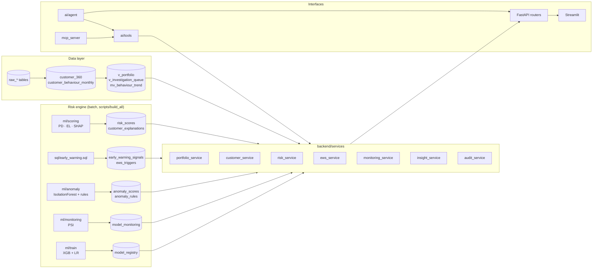

# Architecture

## Design principles
1. **One source of truth.** Every number comes from PostgreSQL or the model at request time. The UI holds no business logic.
2. **Layered and replaceable.** Data → SQL analytics → risk engine → services → API → UI / AI / MCP. Streamlit can be swapped for React without touching the backend.
3. **Governed AI.** The AI reaches data only through named tools and a read-only SQL guard, and every call is audited.
4. **Honest provenance.** Each metric is labelled observed, model, derived or assumption.
5. **Reproducible.** One command (`python -m scripts.build_all`) rebuilds everything from raw files with fixed seeds.

## Component view

## Request flow: a filter change on the Portfolio page
1. Streamlit stores the selection in `session_state["rl_filters"]`, shared by every page and passed to the AI as context.
2. `frontend/utils/api.py` calls `GET /portfolio/summary?product=Revolving loans&risk_tier=High…`. The cache key includes every parameter, so results are never stale.
3. `backend/api/deps.py` parses the parameters into `PortfolioFilters`. `build_where()` validates each value against the domain (unknown value → 422) and produces a parameterised `WHERE` clause; values are never interpolated into SQL text.
4. `portfolio_service` runs aggregate SQL on `v_portfolio` (customer-keyed, indexed). Typical latency is 25–250 ms.

## Batch build (scripts/build_all.py)
| Step | Module | Output | Time (62k applicants) |
|---|---|---|---|
| 1 ETL | etl/run_pipeline | raw_* tables, data_quality_checks, customer_360 | ~70 s |
| 2 Analytics | sql/portfolio_metrics.sql | views, behaviour trend | ~2 s |
| 3 Models | ml/train + ml/scoring | registry, risk_scores, SHAP | ~35 s |
| 4 Early warning | sql/early_warning.sql | triggers, scores | ~1 s |
| 5 Anomaly | ml/anomaly | anomaly scores and rules | ~5 s |
| 6 Monitoring | ml/monitoring | PSI, drift, performance | ~3 s |

## Security and governance
- **SQL injection:** all filters are parameterised and validated against known values.
- **AI data access:** tools only. The SQL tool validates statements (single SELECT, whitelist, blocked keywords and functions), runs READ ONLY with a statement timeout and row cap, and connects as `risklens_ai`, which has SELECT only on analytical objects and no audit-log access.
- **Audit:** `audit_log` records AI queries, tool calls (parameters plus result summary), responses, investigations opened, risk scoring, anomaly scoring, model registration and monitoring runs.
- **Secrets:** environment variables only (`.env` is git-ignored).
- **Decision support:** the AI recommends analyst actions and never approves or rejects credit.

## Error handling
| Failure | Behaviour |
|---|---|
| Database down | API returns 503 with a clear message; the sidebar shows "database offline" |
| Customer not found / malformed ID | 404 with a message; the UI shows a warning, not a crash |
| Invalid filter | 422 listing the invalid values |
| Model artefact missing | 503 "run `python -m ml.train`" |
| No LLM key | offline planner mode (tools still run on live data) |
| LLM service error | automatic fallback to the planner, logged as `ai_error` |
| Tool error | captured and returned to the model or planner; the agent continues |
| Empty selection | empty-state message instead of empty charts |

## Deployment
**Option A: Docker (one host).** `docker-compose.yml` runs `db` (Postgres 16), `build` (one-off job), `api`, `ui` and an optional `mcp` service from a single image. Data is mounted from `./data`; model artefacts live on a named volume.

**Option B: managed services.**
1. Create a managed PostgreSQL instance (Neon, Supabase or Render) and set `DATABASE_URL`.
2. Run `python -m scripts.build_all` once from any machine that has the CSVs.
3. Deploy the API (Render, Railway or Fly.io): `uvicorn backend.main:app --host 0.0.0.0 --port $PORT`, with model artefacts in the image or a volume.
4. Deploy the UI (Streamlit Community Cloud, entry `streamlit_app.py`) with `API_URL` set to the API URL.
5. Optionally set `LLM_PROVIDER` and `LLM_API_KEY` as secrets.

**Scaling notes.** Aggregations hit `v_portfolio` (one row per customer); at millions of customers, materialise `v_portfolio` and refresh it after scoring, partition behaviour tables by month, and move SHAP storage to top-k only (already the case).
